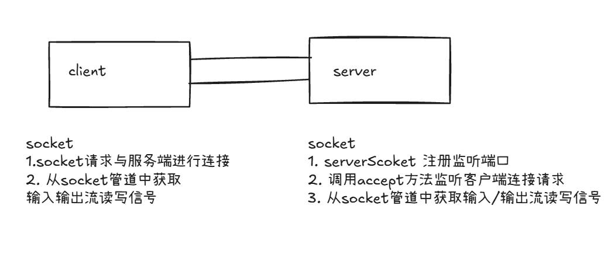

## 通信技术整体解决的问题

- 局域网内的通信要求
- 多系统间的底层消息传递机制
- 高并发下，大数据量的通信场景需要

# Java IO 的演进之路

## IO模型基本说明

IO模型：就是用什么样的通道或者说是通信模式和架构进行数据的传输和接收，很大程度上决定了程序通信的性能
Java 共支持3种网络编程的io模型：`BIO`、`NIO`、`AIO`

## IO模型

### BIO

同步并阻塞（传统阻塞型），服务器实现模式为一个连接一个线程，即客户端有连接请求时服务器端就要启动一个线程进行处理。
如果这个线程只连接，并不处理任何任务，会造成不必要的开销

### NIO

同步非阻塞，服务器实现模式为一个线程处理多个请求（连接），即客户端发送的连接请求都会注册到多路复用器上，多路复用器轮询到连接有IO请求就进行处理

### AIO

异步非阻塞，服务器实现模式为一个有效请求一个线程，客户端的I/O请求都是由OS先完成再通知服务器应用去启动线程进行处理，
一般用于连接数较多且连接时间较长的应用

## BIO、NIO、AIO 适用场景分析
1. BIO 方式适用于连接数目比较小且固定的架构，这种方式对服务器资源要求比较高，并发局限于应用中，JDK1.4以前唯一选择，程序简单易理解
2. NIO 方式适用于连接数目多且连接比较短的架构，如聊天服务器，弹幕系统，服务器间通讯等，编程比较复杂，JDK1.4开始支持
3. AIO 方式适用于连接数目多且连接比较长的架构，比如相册服务器，充分调用OS参与并发操作，编程比较复杂，JDK7开始支持

# Java BIO

## 基本介绍

- Java BIO 就是传统的 java io 编程，其相关的类和接口在 java.io 包下
- BIO（blocking I/O） 同步阻塞，服务器实现模式为一个连接一个线程,即客户端有连接请求时服务器端就需要启动一个线程进行处理，如果这个连接不做任何事情会造成不必要的线程开销
> 可以通过线程池机制改善（实现多个客户端连接服务器）

## 工作机制

## 编程实例
