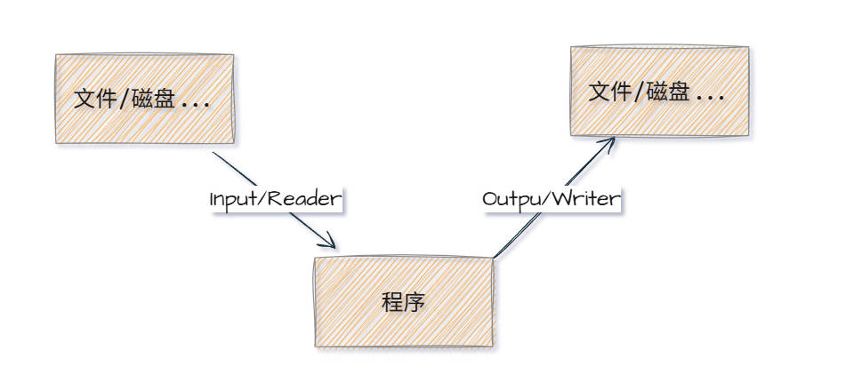
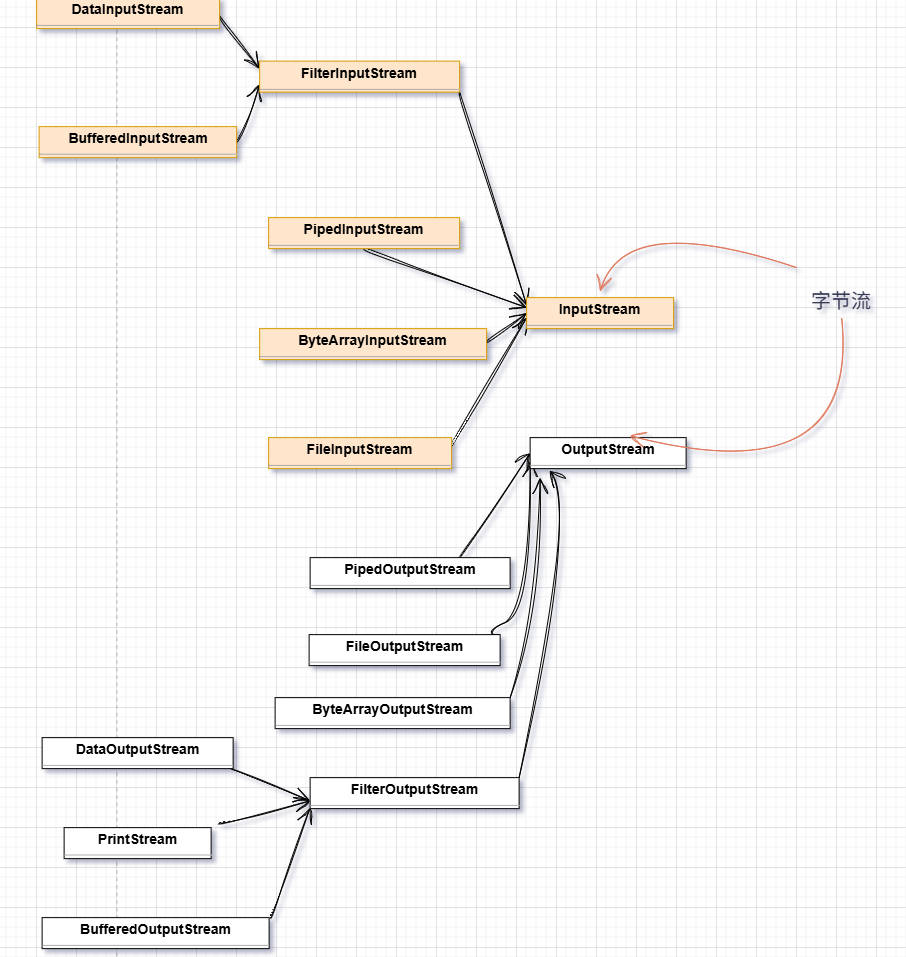
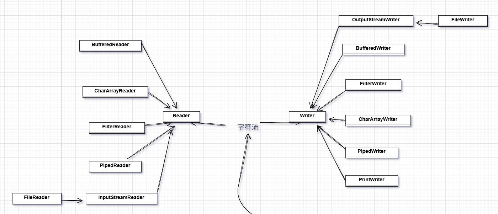

# Java 体系概述

Java I/O (输入/输出) 体系是 Java 中用于处理输入和输出操作的核心 API，主要位于 `java.io` 和 `java.nio` 包中。



---

## 按照传输方式

主要分为字节流和字符流

### 字节流



- 以字节(8位)为单位进行传输
- 基类：`InputStream`、`OutputStream`
- 可以处理所有类型的数据，包括二进制数据

### 字符流



- 以字符(16位Unicode)为单位传输
- 基类：`Reader`、`Writer`
- 自动处理编码转换，适合文本数据

### 字节字符转换

> `InputStreamReader` - 编码 - 将字符转换为字节  
> `OutputStreamWriter` - 解码 - 将字节组合成字符  
> 两者都使用了装饰器模式  
> 两者使用最好都指定编码格式

```java
try(InputStreamReader in = new InputStreamReader(
        new FileInputStream("E:\\desktop\\bug虫洞栈\\learn\\io\\doc\\file.txt"),"gbk");
    OutputStreamWriter osw = new OutputStreamWriter(
        new FileOutputStream("E:\\desktop\\bug虫洞栈\\learn\\io\\doc\\file1.txt"), StandardCharsets.UTF_8))
{
    int len = 0;
    char[] buf = new char[4];
    while((len = in.read(buf))!= -1){
        osw.write(buf,0,len);
    }
    osw.flush();
}
```

## 常见类使用
- 磁盘操作 File
- 字节操作  InputStream/OutputStream
- 字符操作  Reader/Writer
- 对象操作  对象序列化/反序列化

### File
File类表示文件或目录的信息

### 对象序列化/反序列化
> 序列化就是将一个对象转换为字节序列，方便存储和运输

**序列化**
> ObjectInputStream.writeObject() 
**反序列化**
> ObjectOutputStream.readObject()

要对某对象进行序列化或反序列化，该对象必须实现`Serializable`接口

```java
        Person json = new Person(11, "json");

        String objectFile = "E:\\desktop\\bug虫洞栈\\learn\\io\\doc\\json.dat";

        // 序列化
        ObjectOutputStream objectOutputStream = new ObjectOutputStream(new FileOutputStream(objectFile));
        objectOutputStream.writeObject(json);
        objectOutputStream.close();
        System.out.println("序列化完成");
        // 反序列化
        ObjectInputStream ois = new ObjectInputStream(new FileInputStream(objectFile));
        Person o = (Person) ois.readObject();
        ois.close();
        System.out.println(o.getName());
```
**transient**
transient 关键字可以使一些属性不会被序列化。