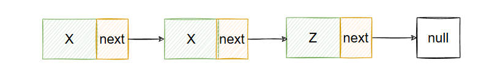
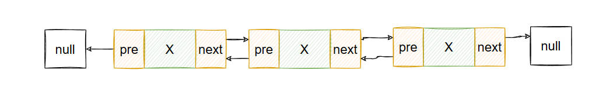
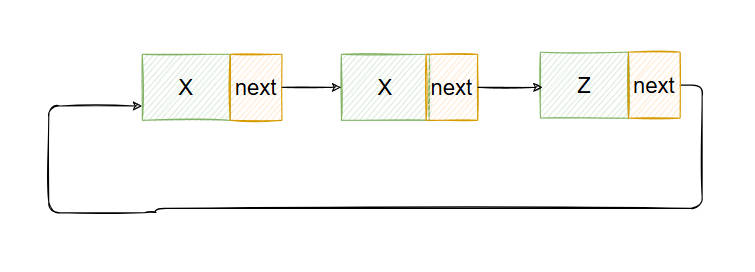

# 数据结构

## 一、链表

### 1.1 单向链表
> 单向链表是一种线性数据结构，其中每个元素都是一个单独的对象，每个对象都有一个指向下一个对象的引用。

### 1.2 双向链表
> 双向链表是一种线性数据结构，其中每个元素都是一个单独的对象，每个对象都有一个指向下一个对象的引用和一个指向前一个对象的引用。

### 1.3 循环链表
> 循环链表是一种线性数据结构，其中每个元素都是一个单独的对象，每个对象都有一个指向下一个对象的引用。
> 循环链表的最后一个元素指向第一个元素，形成一个环。
> 循环链表的操作和单向链表的操作类似，但是循环链表的遍历可以从任意一个元素开始，也可以从最后一个元素开始。
> 循环链表的遍历可以使用do-while循环或者for循环来实现。

