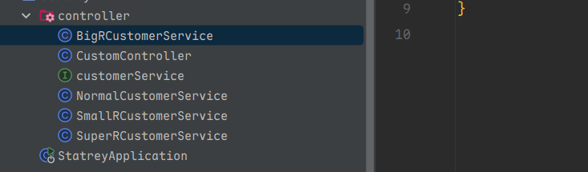
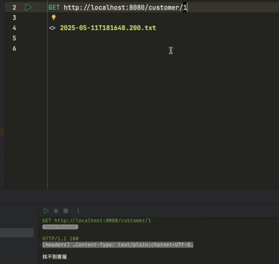

## 策略模式
初始版本 `if - else`

```java
@RestController
public class CustomController {
    @RequestMapping("/api/{recharge}")
    public String customer(@PathVariable(value = "recharge") int recharge) {
        if(recharge > 0 && recharge <= 100) {
            return "普通玩家客服";
        }
        if(recharge > 100 && recharge <= 10000){
            return "小R玩家客服";
        }
        if(recharge > 10000 && recharge <= 100000){
            return "大R玩家客服";
        }
        if(recharge > 100000){
            return "专属客服";
        }
        return "找不到客服";
    }
}
```

若之后需求变更，用户充值金额大于100000且小于100_0000时是"超R玩家客服"，用户充值金额大于100_0000是才是"专属客服"

>需要新增一个`if`语句

```java
if(recharge > 100000 && recharge <= 100_0000){
    return "超R玩家客服";
}
if(recharge > 100_0000){
    return "专属客服";
}
```

如此需求变更，代码更改麻烦，难以维护。

**如何解决这些`if - else`语句**

观察代码，整段代码的逻辑：

1. 如何找到客服
2. 如何根据条件找到客服



定义一个接口`customerService`

```java
public interface customerService {

    /**
     * 寻找客服接口
     * @return
     */
    String findCustomer();
}
```

将符合条件之后的内容抽离，封装成策略类

> 普通玩家

```java
public class NormalCustomerService implements customerService {
    @Override
    public String findCustomer() {
        System.out.println("普通玩家客服");
        return "普通玩家客服";
    }
}
```

>小R玩家

```java
package com.liu.statrey.controller;

public class SmallRCustomerService implements customerService {
    @Override
    public String findCustomer() {
        System.out.println("小R玩家客服");
        return "小R玩家客服";
    }
}

```

>大R玩家

```java
package com.liu.statrey.controller;

public class BigRCustomerService implements customerService {
    @Override
    public String findCustomer() {
        System.out.println("大R玩家客服");
        return "大R玩家客服";
    }
}

```

>超R玩家

```java
package com.liu.statrey.controller;

public class SuperRCustomerService implements customerService {
    @Override
    public String findCustomer() {
        System.out.println("超R玩家客服");
        return "超R玩家客服";
    }
}

```

请求类：

```java
package com.liu.statrey.controller;


import org.springframework.web.bind.annotation.PathVariable;
import org.springframework.web.bind.annotation.RequestMapping;
import org.springframework.web.bind.annotation.RequestMethod;
import org.springframework.web.bind.annotation.RestController;

@RestController
public class CustomController {
    @RequestMapping(value = "/api/{recharge}",method = RequestMethod.GET)
    public String customer(@PathVariable(value = "recharge") int recharge) {
        if(recharge > 0 && recharge <= 100) {
            return new NormalCustomerService().findCustomer();
        }
        if(recharge > 100 && recharge <= 10000){
            return new SmallRCustomerService().findCustomer();
        }
        if(recharge > 10000 && recharge <= 100000){
            return new BigRCustomerService().findCustomer();
        }
        if(recharge > 100000 && recharge <= 100_0000) {
            return new SuperRCustomerService().findCustomer();
        }
        return "找不到客服";
    }
}

```

接下来的问题是代码中的`if` 判断条件如何进行封装，让该策略类能够支持其特有条件。

接口改造：

```java
package com.liu.statrey.controller;

public interface customerService {
	/**
	该客服对应金额
	*/
    boolean support(int recharge);
    /**
     * 寻找客服接口
     * @return
     */
    String findCustomer();
}

```

客服服务类改造（其余同理）：

```java
package com.liu.statrey.controller;

public class SmallRCustomerService implements customerService {
    @Override
    public boolean support(int recharge) {
        return recharge > 100 && recharge <= 10000;
    }

    @Override
    public String findCustomer() {
        System.out.println("小R玩家客服");
        return "小R玩家客服";
    }
}

```

在收到一个充值金额值，我们需要判断这个金额与之所匹配的是哪种策略，然后再调用策略中的`findCustomer()`方法，寻找对应客服。

将所有的策略中放到`Spring`容器中，在实现类上加上`@Component`注解，交给`Spring`管理

```java
@Component
public class NormalCustomerService implements customerService {
    @Override
    public boolean support(int recharge) {
        return recharge > 0 && recharge <= 100;
    }

    @Override
    public String findCustomer() {
        System.out.println("普通玩家客服");
        return "普通玩家客服";
    }
}
```

请求接口类：

```java
@RestController
public class CustomController {

    @Resource
    private List<customerService> customerServiceList;

    @RequestMapping(value = "/api/{recharge}",method = RequestMethod.GET)
    public String customer(@PathVariable(value = "recharge") int recharge) {
        for (customerService service : customerServiceList) {
            if(service.support(recharge)){
                return service.findCustomer();
            }
        }
        return "找不到客服";
    }
}
```

创建一个兜底策略

```java
@Component
public class defaultCustomer implements customerService{
    @Override
    public boolean support(int recharge) {
        return true;
    }

    @Override
    public String findCustomer() {
        return "找不到客服";
    }
}
```

请求该接口：



当充值金额为1，响应是`找不到客服`。

原因是`List<customerService>`其中的`defaultCustomerService`排列顺序并不是在最后，把`NormalCustomerService`中的判断给截断了，不会判断普通客服的条件。

解决办法：

添加`@Order(1)`注解，其中默认值是`Integer.MAX_VALUE;`,所以值越小，优先级越高。

>策略模式逻辑：
>
>1. 抽象逻辑
>2. 实现具体逻辑策略
>3. 选择一个不同的策略
>4. 调用策略的具体逻辑

上述是具体策略支持哪个金额，接下来将选择策略交给主流程完成。

定义一个枚举类：

```java
package com.liu.statrey.controller;

public enum UserType {
    NORMAL,
    SMALL,
    BIG,
    SUPER,
    PERSONAL
}

```

接口改造：

```java
package com.liu.statrey.controller;

public interface customerService {

    UserType support();

    /**
     * 寻找客服接口
     * @return
     */
    String findCustomer();
}

```

```java
@Component
@Order(1)
public class NormalCustomerService implements customerService {
    @Override
    public UserType support() {
        return UserType.NORMAL;
    }


    @Override
    public String findCustomer() {
        System.out.println("普通玩家客服");
        return "普通玩家客服";
    }
}
```

接口请求类：

```java
@RestController
public class CustomController {

    @Resource
    private List<customerService> customerServiceList;

    @RequestMapping(value = "/api/{recharge}",method = RequestMethod.GET)
    public String customer(@PathVariable(value = "recharge") int recharge) throws IllegalAccessException {
        for (customerService service : customerServiceList) {
            if(service.support().equals(analizeUserType(recharge))){
                return service.findCustomer();
            }
        }
        throw new IllegalAccessException(recharge + "无法找到对应处理器");
    }

    private UserType analizeUserType(int recharge) {
        if(recharge > 0 && recharge <= 100){
            return UserType.NORMAL;
        }
        if(recharge > 100 && recharge <= 10000){
            return UserType.SMALL;
        }
        if(recharge > 10000 && recharge <= 100000){
            return UserType.BIG;
        }
        if(recharge > 100000 && recharge <= 1000000){
            return UserType.SUPER;
        }
        return null;
    }
}
```

但是`if-else`还是没有去除，如何解决`if - else`

枚举中的`NORMAL	、 SMALL`等都是有隐含意义，隐含着**是通过什么样的充值金额返回的**

 ```java
 package com.liu.statrey.controller;
 
 import java.util.function.IntPredicate;
 
 public enum UserType {
     NORMAL(recharge -> recharge > 0 && recharge <= 100),
     SMALL(recharge -> recharge > 100 && recharge <= 1000),
     BIG(recharge -> recharge > 1000 && recharge <= 10000),
     SUPER(recharge -> recharge > 10000 && recharge <= 100000),
     PERSONAL(recharge -> recharge > 100000 && recharge <= 1000000);
 
     private final IntPredicate support;
 
     UserType(IntPredicate support){
         this.support = support;
     }
 
     public static UserType typeof(int recharge){
         for (UserType value : values()) {
             if(value.support.test(recharge)){
                 return value;
             }
         }
         return null;
     }
 }
 
 ```

请求接口改造：

```java
package com.liu.statrey.controller;


import org.springframework.web.bind.annotation.PathVariable;
import org.springframework.web.bind.annotation.RequestMapping;
import org.springframework.web.bind.annotation.RequestMethod;
import org.springframework.web.bind.annotation.RestController;

import javax.annotation.Resource;
import java.util.List;

@RestController
public class CustomController {

    @Resource
    private List<customerService> customerServiceList;

    @RequestMapping(value = "/api/{recharge}",method = RequestMethod.GET)
    public String customer(@PathVariable(value = "recharge") int recharge) throws IllegalAccessException {
        UserType userType = UserType.typeof(recharge);
        for (customerService service : customerServiceList) {
            if(service.support().equals(userType)){
                return service.findCustomer();
            }
        }
        throw new IllegalAccessException(recharge + "无法找到对应处理器");
    }


}

```

此时还存在一种情况，有`100`个请求就需要遍历 100 次，时间复杂度为$O(n)$

并且每一种用户类型对应一种策略，则`List`改造成为`Map`类型

请求接口改造：

```java
@RestController
public class CustomController {


    private Map<UserType,customerService> typecustomerServiceMap;

    @RequestMapping(value = "/api/{recharge}",method = RequestMethod.GET)
    public String customer(@PathVariable(value = "recharge") int recharge) throws IllegalAccessException {
        UserType userType = UserType.typeof(recharge);
        customerService customerService = typecustomerServiceMap.get(userType);
        return customerService.findCustomer();
    }

    @Autowired
    public void setTypecustomerServiceMap(List<customerService> customerServiceList){
        this.typecustomerServiceMap =
                customerServiceList.stream()
                        .collect(Collectors.toMap(customerService::support, customerService -> customerService));
    }
}

```

上述代码若`UserType`为`null`，则会出现空指针异常。

改造：

```java
@RestController
public class CustomController {


    @Resource
    private defaultCustomer defaultCustomer;

    private Map<UserType,customerService> typecustomerServiceMap;

    @RequestMapping(value = "/api/{recharge}",method = RequestMethod.GET)
    public String customer(@PathVariable(value = "recharge") int recharge) throws IllegalAccessException {
        UserType userType = UserType.typeof(recharge);
        // 添加兜底策略
        customerService customerService = typecustomerServiceMap.getOrDefault(userType,defaultCustomer);
        return customerService.findCustomer();
    }

    @Autowired
    public void setTypecustomerServiceMap(List<customerService> customerServiceList){
        this.typecustomerServiceMap =
                customerServiceList.stream()
                        .filter(customerService -> customerService.support() != null)
                        .collect(Collectors.toMap(customerService::support, customerService -> customerService));
    }
}

```

`customerService`是一个寻找客服的策略，那么其中就不必要多一个该策略支持所需金额的逻辑。

使用注解改造。

```java
package com.liu.statrey.controller;

import java.lang.annotation.Retention;
import java.lang.annotation.Target;

import static java.lang.annotation.ElementType.*;
import static java.lang.annotation.RetentionPolicy.RUNTIME;

@Target(TYPE)
@Retention(RUNTIME)
public @interface SupportAnnonation {

    UserType value();
}

```

```java
@Component
@SupportAnnonation(UserType.NORMAL)
public class NormalCustomerService implements customerService {


    @Override
    public String findCustomer() {
        System.out.println("普通玩家客服");
        return "普通玩家客服";
    }
}
```

请求接口改造：

```java
package com.liu.statrey.controller;


import org.springframework.beans.factory.annotation.Autowired;
import org.springframework.web.bind.annotation.PathVariable;
import org.springframework.web.bind.annotation.RequestMapping;
import org.springframework.web.bind.annotation.RequestMethod;
import org.springframework.web.bind.annotation.RestController;

import javax.annotation.Resource;
import java.util.List;
import java.util.Map;
import java.util.stream.Collectors;

@RestController
public class CustomController {


    @Resource
    private defaultCustomer defaultCustomer;

    private Map<UserType,customerService> typecustomerServiceMap;

    @RequestMapping(value = "/api/{recharge}",method = RequestMethod.GET)
    public String customer(@PathVariable(value = "recharge") int recharge) throws IllegalAccessException {
        UserType userType = UserType.typeof(recharge);
        // 添加兜底策略
        customerService customerService = typecustomerServiceMap.getOrDefault(userType,defaultCustomer);
        return customerService.findCustomer();
    }

    @Autowired
    public void setTypecustomerServiceMap(List<customerService> customerServiceList) throws IllegalAccessException {
        this.typecustomerServiceMap =
                customerServiceList.stream()
                        .filter(customerService -> customerService.getClass().isAnnotationPresent(SupportAnnonation.class))
                        .collect(Collectors.toMap(this::getType, customerService -> customerService));
        if(UserType.values().length != typecustomerServiceMap.size()){
            throw new IllegalAccessException("没有对应的处理器");
        }
    }


    private UserType getType(customerService customerService){
        return customerService.getClass().getAnnotation(SupportAnnonation.class).value();
    }
}

```


之后再需要添加不同策略，只需要添加枚举类中的用户类别，再添加相应处理器。