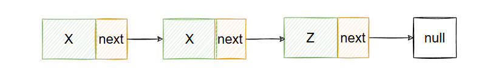
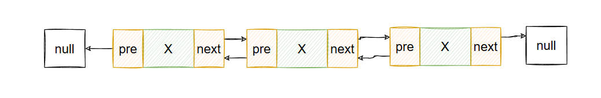
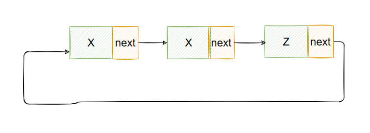

# 数据结构

## 一、链表

### 1.1 单向链表

> 单向链表是一种线性数据结构，其中每个元素都是一个单独的对象，每个对象都有一个指向下一个对象的引用。



### 1.2 双向链表

> 双向链表是一种线性数据结构，其中每个元素都是一个单独的对象，每个对象都有一个指向下一个对象的引用和一个指向前一个对象的引用。



### 1.3 循环链表

> 循环链表是一种线性数据结构，其中每个元素都是一个单独的对象，每个对象都有一个指向下一个对象的引用。
> 循环链表的最后一个元素指向第一个元素，形成一个环。
> 循环链表的操作和单向链表的操作类似，但是循环链表的遍历可以从任意一个元素开始，也可以从最后一个元素开始。
> 循环链表的遍历可以使用do-while循环或者for循环来实现。



## LinkedList 实现

定义节点

```java
private static class Node<E> {
		 E val;
		 Node<E> pre;
		 Node<E> next;
		 public Node( Node<E> pre, E val, Node<E> next) {
			 this.val = val;
			 this.pre = pre;
			 this.next = next;
		 }
	}
```

- 在当前节点对象中关联上一个节点和下一个节点，形成了双向链表
- 每次添加新节点都需要创建新的Node节点，这部分操作耗时较长
  头插节点

```java
    /**
	 * 头插
	 * @param e
	 */
	void add_first(E e){
		Node<E> f = first;
		Node< E > newNode = new Node<> (null, e, f);
		first = newNode;
		if(f == null){
			last = newNode;
		}else{
			f.pre = newNode;
		}
		size ++;
	}
```


尾插

```java
/**
 * 尾插
 * @param e 要添加的元素
 */
void add_last(E e) {
    Node<E> l = last;
    Node<E> newNode = new Node<>(l, e, null);
    last = newNode;
    if(l == null) {
        first = newNode;
    } else {
        l.next = newNode;
    }
    size++;
}
```


拆链操作

```java
    /**
	 * 拆链
	 * @param x
	 */
	E unLink(Node<E> x){
		E element = x.val;
		Node<E> prev = x.pre;
		Node<E> next = x.next;

		if(prev == null){
			first = next;
		}else{
			prev.next = next;
			x.pre = null;
		}

		if(next == null){
			last = prev;
		}else{
			next.pre = prev;
			x.next = null;
		}
		x.val = null;
		size --;
		return element;
	}
  
```

删除节点

```java
    /**
	 * 删除元素
	 * @param o
	 */
	boolean remove(Object o){
		if(o==null){
			for(Node<E> x = first; x!=null;x=x.next){
				if(x.val == null){
					unLink (x);
					return true;
				}
			}
		}else{
			for(Node<E> x = first; x!=null;x=x.next){
				if(o.equals (x.val)){
					unLink (x);
					return true;
				}
			}
		}
		return false;
	}
```

## LinkedList 源码分析

## 常见面试问题

- 描述一下链表的数据结构

> 链表包含数据域和指针域，数据域存储的是该节点的值，指针域存储的是下一个节点的内存地址，指向下一个节点

- Java中LinkedList 使用的是单向链表、双向链表还是循环链表

> 双向链表,支持双向遍历

- 链表中数据的插入、删除、获取元素，时间复杂度是多少

| 操作      | 时间复杂度 |                     说明 |
| --------- | :--------: | -----------------------: |
| 头插/尾插 |    O(1)    | 只需要改变头尾指针的指向 |
| 随机插入  |    O(n)    |       需要遍历到指定位置 |
| 删除头/尾 |    O(1)    |                          |
| 按值删除  |    O(n)    |               需要先查找 |
| 随机访问  |    O(n)    |             需要从头遍历 |
| 查找元素  |    O(n)    |                 顺序访问 |

- 什么场景下使用链表更加合适

> 链表适用于需要频繁插入、删除元素的场景，不适合需要频繁获取元素的场景
> 不适用的场景： 需要随机访问、内存紧张（链表每个节点额外消耗两个指针空间）、CPU缓存（节点内存不连续）

## 二、数组

### 2.1 一维数组

### 2.2 二维数组

## 实现数组列表

## ArrayList 源码分析

## 常见面试问题

- 数据结构中有哪些是线性表数据结构
- 数组的元素删除和获取，时间复杂度是多少
- ArrayList 中默认的初始长度是多少
- ArrayList 中扩容的范围是多大一次
- ArrayList是如何完成扩容的，System.arrayCopy各个入参的作用是什么

## 队列

### 队列数据结构

### 延迟队列介绍

#### 延迟队列说明

#### 二叉堆结构

### 延迟队列实现

## 常见面试问题

- 单端队列和双端队列，分别对应的实现类是哪个
- 简述延迟队列/优先队列的实现方式
- 二叉堆插入/弹出元素的过程
- 延迟队列的使用场景
- 延迟队列为什么添加信号量
