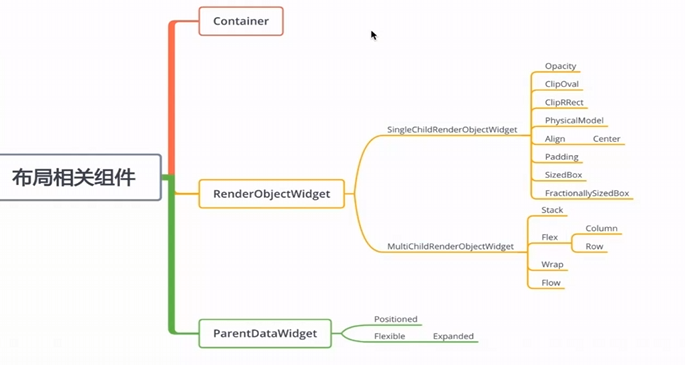

# `Flutter`布局开发

常用组件



## `RenderOnjectWidget`

## `SignleChildReaderObjectWidget`

#### `Opacity`

> 作用是控制其子组件的透明度

**核心概念**

`Opacity`本身不负责绘制内容，它只负责改变子组件的显示效果

通过一个 `opacity`参数来控制透明度，从 `0.0 (完全透明) -> 1.0(不透明)`

##### 基本用法

```dart
Container(
    height: 100,
    // color: Colors.lightBlue,
    child: Opacity(
        opacity: 1, // 1.0 表示完全不透明
        child: Container(
            color: Colors.lightBlue, // 再次设置颜色（Opacity 不继承父级 color）
            child: Center(child: Text("Hello")),
        ),
    ),
```

#### `ClipOval`

##### 作用

`ClipOval` 用于 **将其子组件裁剪成一个椭圆形（oval）或圆形（circle）**。

- 如果子组件是正方形，裁剪后就是**圆形**。
- 如果子组件是长方形，裁剪后就是**椭圆形**。

##### 基本用法

```dart
ClipOval(
    child: Container(
        height: 200,
        width: 200,
        color: Colors.blue,
    ),
)
```

#### `ClipRRect`

##### 作用：

- 将子组件（如图片、容器）的四个角裁剪成圆角。
- 防止子组件的内容超出圆角边界。
- 常用于创建圆角卡片、圆角图片、按钮等 UI 元素。

##### 基本用法：

```dart
ClipRRect(
    borderRadius: BorderRadius.circular(16),
    child: Container(
        height: 50,
        width: 50,
        color: Colors.blue,
    ),
)
```

#### `PhysicalModel`

##### 作用

1. 创建 Material 表面

   - 模拟 Material Design 中的“纸张”效果。
   - 可以设置阴影和海拔，让组件看起来“浮”在页面上。
2. 自动裁剪子组件

   - 如果子组件超出 `PhysicalModel` 的边界，会自动被裁剪。
3. 支持圆角和阴影

   - 可以设置 `borderRadius` 来创建圆角。
   - 

   通过 `elevation` 添加阴影效果

##### 基本用法

```dart
PhysicalModel(
    elevation: 20.0, // 海拔高度，决定阴影深浅
    color: Colors.black12, // 背景色
    shadowColor: Colors.black, // 阴影颜色
    borderRadius: BorderRadius.circular(12), // 圆角
    clipBehavior: Clip.antiAlias, // 裁剪行为
    child: Container(
        width: 200,
        height: 100,
        color: Colors.blue,
        child: Center(child: Text('Hello')),
    ),
)
```

#### `FractionallySizedBox`

##### 作用

- 按**百分比**或**分数**设置子组件的宽度和高度。
- 适用于响应式布局，适配不同屏幕尺寸。
- 常用于居中、填充、比例布局等场景。

##### 基本用法

```dart
FractionallySizedBox({
    Key? key,
    double? widthFactor,   // 宽度占父容器的比例（0.0 ~ 1.0）
    double? heightFactor,  // 高度占父容器的比例（0.0 ~ 1.0）
    AlignmentGeometry alignment = Alignment.center,
    Widget? child,
})

Container(
color: Colors.grey,height: 200,
child: FractionallySizedBox(
    widthFactor: 0.8, // 80% 宽度
    child: Container(
        color: Colors.blue,
       child: Center(child: Text('80% 宽度')),
    ),
  ),
)
```

> ⚠️ 注意：`widthFactor` 和 `heightFactor` 是**相对于父容器**的，且必须在 `0.0` 到 `1.0` 之间（`1.0` 表示 100%）。

## `MultiChildReaderObjectWidget`

#### `Stack`

 Flutter 中，`Stack` 是一个非常重要的布局组件，用于将多个子组件**层叠**（重叠）排列。它类似于 CSS 中的 `position: absolute`，允许你将多个组件放置在同一个空间中，并通过控制它们的位置来实现复杂的 UI 效果。

`Positioned` 用于对 `Stack` 中的子组件进行**精确定位**，仅在 `Stack` 的子组件中有效。

##### 基本用法

```dart
Stack(
    children: [
        Container(
            height: 50,
            color: Colors.blueGrey,
        ),
        Positioned(
            right: 20,
            top: 30,
            child: Container(
                height: 40,
                color: Colors.lightGreenAccent,
                child: Text("positioned")
            )
        ),
    ],
),
```

#### `Flex`

- `Column`

    纵向布局，可以有多个子元素

- `Row`

    横向元素

```dart
Row(
    children: [
        Container(
            margin: EdgeInsets.all(10),
            height: 50,
            color: Colors.lightGreenAccent,
            child: Text("c1"),
        ),
        Container(
            height: 50,
            color: Colors.blueGrey,
            child: Text("c2"),
        ),
        Container(
            height: 50,
            color: Colors.blue,
            child: Text("c3"),
        ),
    ],
),
```

#### `Wrap`

##### 作用

将子组件按行或按列排列，并在空间不足时自动“换行”或“换列”显示。

##### 基本用法

```dart
Wrap(
    children: [
        Chip(label: Text('HTML')),
        Chip(label: Text('CSS')),
        Chip(label: Text('JavaScript')),
        Chip(label: Text('Dart')),
        Chip(label: Text('Flutter')),
        Chip(label: Text('React')),
    ],
)
```

#### `Flow`

`Flow` 是 Flutter 中一个**高性能、灵活但复杂**的布局组件，主要用于实现**自定义的、复杂的、大量子元素的层叠或动画布局**，比如：

- 粒子动画
- 菜单展开（径向菜单）
- 图标瀑布流
- 自定义的动画过渡效果

##### 作用

`Flow` 允许你通过代码精确控制每一个子组件的位置和绘制行为，实现高性能的自定义布局。

##### 基本用法

```dart
SizedBox(
    height: 60, // 根据子元素大小设置
    child: AnimatedBuilder(
        animation: _animation,
        builder: (context, child) {
            return Flow(
                delegate: MyFlowDelegate(animValue: _animation.value),
                children: [
                    Container(width: 40, height: 40, color: Colors.red),
                    Container(width: 40, height: 40, color: Colors.green),
                    Container(width: 40, height: 40, color: Colors.blue),
                    Container(width: 40, height: 40, color: Colors.yellow),
                    Container(width: 40, height: 40, color: Colors.purple),
                ],
            );
        },
    ),
),
```

## `ParentDataWidget`

### `Positioned`

定位作用

```dart
Stack(
    children: [
        Container(
            height: 50,
            color: Colors.blueGrey,
        ),
        Positioned(
            right: 20,
            top: 30,
            child: Container(
                height: 40,
                color: Colors.lightGreenAccent,
                child: Text("positioned")
            )
        ),
    ],
),
```

### `Flexible`

#### `Expend`

##### 作用

让一个子组件“伸展”并占据父容器中剩余的空间。

##### 基本语法

```dart
Row(
  children: [
    Expanded(
      flex: 2,
      child: Container(color: Colors.red, child: Text("2份")),
    ),
    Expanded(
      flex: 1,
      child: Container(color: Colors.green, child: Text("1份")),
    ),
    Expanded(
      flex: 1,
      child: Container(color: Colors.blue, child: Text("1份")),
    ),
  ],
)
```
