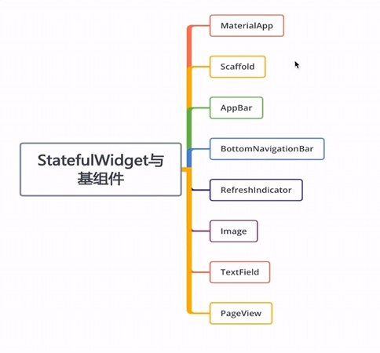
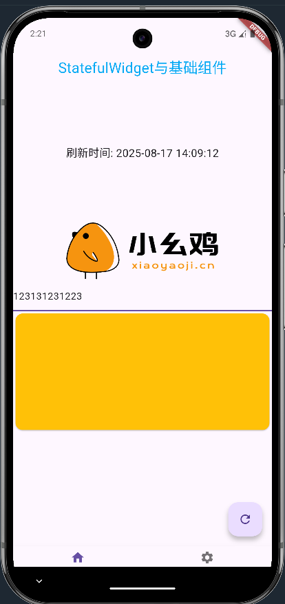

# StatefulWidget与基础组件

## 组件层级结构

```
StatefulWidget
├── MaterialApp         ← 应用入口（根组件）
│   └── Scaffold        ← 页面骨架（包含 AppBar、Body 等）
│       ├── AppBar      ← 顶部导航栏
│       ├── BottomNavigationBar ← 底部标签栏
│       ├── RefreshIndicator ← 下拉刷新控件
│       ├── Image       ← 图片显示
│       ├── TextField   ← 文本输入框
│       └── PageView    ← 滑动页面切换
```

## 常用组件



代码：

```dart
import 'package:flutter/material.dart';

class StatefulGroupWidget extends StatefulWidget {
  const StatefulGroupWidget({super.key});

  @override
  State<StatefulWidget> createState() {
    return _StatefulGroupWidgetState();
  }
}

class _StatefulGroupWidgetState extends State<StatefulGroupWidget> {

  TextStyle ts = TextStyle(color: Colors.lightBlue, fontSize: 24);
  int currentIndex = 0;
  String _refreshText = "下拉刷新试试";
  void onItemTop(index){
    setState(() {
      currentIndex = index;
    });
  }
  Future<void> _flushData () async{
    // 模拟刷新延迟
    await Future.delayed(const Duration(seconds: 1));
    // 这里可以更新数据
    setState(() {
      _refreshText = "刷新时间: ${DateTime.now().toLocal().toString().split('.')[0]}";
    });
  }
  Widget buildPage(int index){
    switch (index) {
      case 0:
      // 首页：支持下拉刷新
        return RefreshIndicator(
          onRefresh:  () async {
            await _flushData();
          },
          child: ListView(
            children: [
              const SizedBox(height: 100),
              Center(
                child: Text(
                  _refreshText,
                  style: const TextStyle(fontSize: 18),
                ),
              ),
              const SizedBox(height: 100),
              Image.network("http://xiaoyaoji.cn/_nuxt/img/52037cb.png",width: 100,height: 100,),
              TextField(),
              SizedBox(
                height: 200,
                child: PageView(
                  controller: PageController(viewportFraction: 1.0),
                  children: [
                    const Card(color: Colors.black12),
                    const Card(color: Colors.lightBlue),
                    const Card(color: Colors.amber),
                  ],
                ),
              )
            ],
          ),
        );
      case 1:
        return const Center(child: Text("设置页面"));
      default:
        return const Center(child: Text("未知页面"));
    }
  }


  @override
  Widget build(BuildContext context) {
    return MaterialApp(
        title: "StatefulWidget与基础组件",
        home: Scaffold(
          // 顶部导航栏
          appBar: AppBar(
              title: Text("StatefulWidget与基础组件"),
              centerTitle: true,
              titleTextStyle: ts
          ),
          // 中间主体内容
          body:  buildPage(currentIndex), // 根据索引显示不同也买你
          // 底部导航栏
          bottomNavigationBar: BottomNavigationBar(
            currentIndex: currentIndex,
            // 点击回调 onItemTop 方法，切换页面
            onTap: onItemTop,
              items: const [
                BottomNavigationBarItem(icon: Icon(Icons.home),label: "首页"),
                BottomNavigationBarItem(icon: Icon(Icons.settings),label: "设置"),
              ]
          ),
          // 悬浮球
          floatingActionButton: currentIndex == 0
              ? FloatingActionButton(
            onPressed: () async {
              await _flushData();
            },
            tooltip: '刷新',
            child: const Icon(Icons.refresh),
          )
              : null,
          floatingActionButtonLocation: FloatingActionButtonLocation.endFloat,
        )
    );
  }
}

```

效果图：


