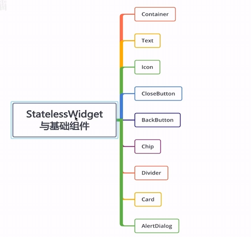
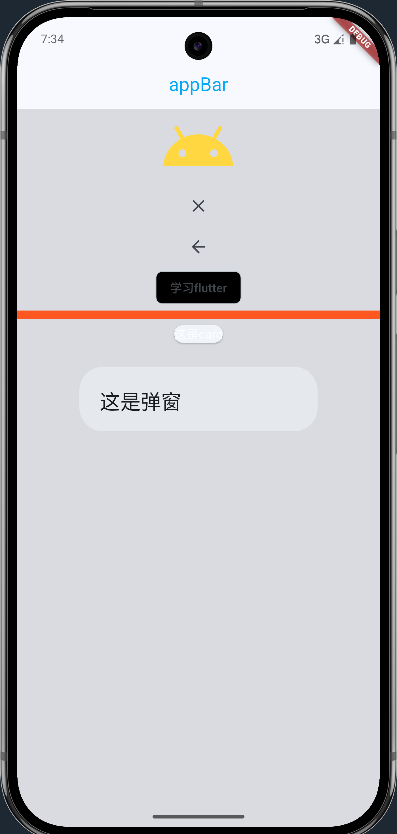

# `StatelessWidget`与基础组件

在 Flutter 中，`StatelessWidget` 是构建用户界面的基础组件之一。它用于创建**不会随时间改变状态**的 UI 组件。一旦创建，其属性不会改变（除非父组件重新创建它），因此称为“无状态”。

## 一、`StatelessWidget` 的特点

- **不可变性**：所有数据都是 final（或不可变的）。
- **轻量高效**：因为没有状态管理，性能好。
- **常用于静态 UI**：如图标、标签、按钮等不随用户交互改变内容的组件。
- **必须重写 `build` 方法**。


## 二、常用组件：



## 五、何时使用 `StatelessWidget？`

适合场景：

- 数据来自父组件（通过构造函数传入）。
- UI 是静态的或只依赖输入参数。
- 不需要响应用户输入改变自身外观（交由父组件处理）。

❌ 不适合：

- 需要维护内部状态（如计数器、表单输入等）→ 应使用 `StatefulWidget`。

完整代码：

```dart
import 'package:flutter/material.dart';

class StatelessGroupWidget extends StatelessWidget {
    const StatelessGroupWidget({super.key});

    @override
    Widget build(BuildContext context) {
        TextStyle ts = TextStyle(color: Colors.lightBlue);
        return Scaffold(
            appBar: AppBar(
                title: Text("appBar", style: ts),
                centerTitle: true,
                shadowColor: Colors.lightBlue,
            ),
            body: SizedBox.expand(
                child: Container(
                    decoration: BoxDecoration(color: Colors.black12),
                    child: Column(children: [
                        Icon(
                            Icons.android,
                            color: Colors.amberAccent,
                            size: 90,
                        ),
                        CloseButton(),
                        BackButton(),
                        Chip(label: Text("学习flutter"), backgroundColor: Colors.black),
                        Divider(
                            thickness: 10,
                            color: Colors.deepOrange,
                        ),
                        Card(
                            child: Text(
                                "这是card",
                                style: TextStyle(color: Colors.white),
                            ),
                        ),
                        AlertDialog(
                            title: Text("这是弹窗"),
                        )
                    ]),
                ),
            ));
    }
}

```

